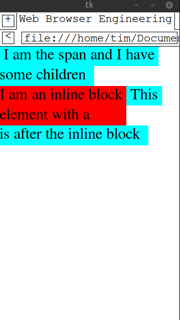

# Chapter 8

Meow Meow Meow Meow 

Its a good thing we did our rework a little while back, but it does mean we have to integrate the new code into our layout engine. In fact, I think I will have to read through the chapter first to get an idea of what will be implemented since my approach will have to be different from the books. For one, I want to use a different approach for buttons (essentially doing ex 8.8 early).

So input can literally just be a combination of inline layouts? we could have the input layout having the inline layout followed by the input. So InputLayout can hold an inline layout (which is the non-input portion) and directly keep track of the input on the rhs. BUT: are we going to implement labels?? 

One thing to take note of is that there are various types of inputs: text, image, radio buttons etc. May need to subclass for each of them.

So for labels: they will be interpreted as inline layouts and if they are next to the inputs they match to (which I imagine they would normally be) there isn't really a need to handle them differently. In this case, InputLayout can be a standalone class with nothing else special. 

Buttons might be interesting to handle. We could sublass them but I don't think we need to.

Something interesting is that the book uses a button for form submission, but per my understanding it should be ```input type="submit"```. I will implement things that way since in my mind, buttons should always have explicit 'on click' handlers that define what they do. 

So, let's subclass input layout and make:
* text (default)
* submit (different in that it has its own inner text set and a custom on click function). Inner text depends on [value](https://developer.mozilla.org/en-US/docs/Web/HTML/Reference/Elements/input/submit) or has a default

They will all be inline in nature, so maybe they should sublass the inline layout ... hmm....

Oh wait: [buttons are used in forms when type is submit](https://developer.mozilla.org/en-US/docs/Learn_web_development/Extensions/Forms/Your_first_form#the_button_element). Eugh, gonna need some interesting code to handle this. 

I think Ill keep buttons simple and basically reuse the block layout for them. Anything can act as a button so long as it has an 'onclick' method of sorts. Also on click we can check tag to determine if button, or maybe just make button an input type. 

When I get to 8.8 I'll think about button subclass.

https://developer.mozilla.org/en-US/docs/Web/HTML/Reference/Elements/button#notes
https://developer.mozilla.org/en-US/docs/Web/HTML/Reference/Elements/input

Yeah, my layout engine definitely needs some work ... Hopefully it won't come back  to bite me too much when I get to implementing JS.
I no longer want to use my inheritance pattern for my layout engine, it is making things more complicated for me than they need to be. InputLayout can do its own thing. Maybe I'll come back and make Layout a very very simple class, but until then I am not going to be using it whenever possible. 

Yeah, its time to rework layouts again :/. The reason being is the inline layout class. Specifically:

* Before we only had to worry about 2 kinds of layouts: inline and block
* As such, the lines member of a layout would either only contain lines or only contain one block element
* but now, InputLayout doesn't fit this paradigm
* InputLayout should not go on a new line 
* and it needs to know the x and y coordinates to start at when laying itself out

We may be able to get away with just reworking Inline Layout (as opposed to everything). I think one of the goals should be to have a generic "createLayout" function that can take in a display type and init the layout object in question?

Let's take a better look at how the textbook handled the layout logic in chapter 7 and see if we can get some inspiration. 

# LAYOUT REWORK 
I did attempt a layout rework here but I have decided to scrap that (althought the notes are stilled stored on branch 'failed_relayout'). I am going to go back to the book's layout method so that later chapters can go a lot smoother. 

Maybe eventually I will pull an Andreas Kling and write a better browser for an OS I make myself (~evil laughter~).

So: let's get rid of the fluff in our current layout approach, then make it look a bit more like chapter 7, then add input layout (and then maybe the inline button thing that the exercise wants).

Now that I am removing a bunch of things, i am actually starting to think some of my initial ideas weren't all that bad. Specifically my idea regarding the 'getStartX' and 'getStartY' for Layouts. This would allow us to implement list items rather nice, but yeah. Complicated I guess. Still, KISS then add what we need.

So let's go a little slower now. Very small rework just to clean things up.

* Document Layout child (done)
* Layout getElements at rename (done)
* Layout layout type function -> move to LayoutConstants and rework (done)
* Delete LayoutTypes enum and the Layout layoutType function (done)
* get rid of 'calculateContentWidth' and 'calculateWidth' (done)
* move InlineLayout 'getFont' and rework (done)

So there is some good news and some bad news. The good:
* code is a lot cleaner
* it actually isn't as bad as I initially thought

The bad
* part of our layout algorithm is broken (specifically having block elements on the same line as inline elements)

The good again
* we may as well rework our Inline layout and line layout to be closer to the books, since that should help fix problems down the line.

Okay, so here is the idea:
* An Inline Layout is a collection of Lines
* A line holds a number of Layout-descendant objects
* It also holds a number of rect objects for background displaying (in a separate list)
* every Layout descendant object 
* If a Line holds a Block Layout object, then that is the only element in that line
* Text Fragments will become a new layout object (consider them anon Inline type bois)
* When we flush a line, we just use the getHeight() method to calculate height and then we can work out baseline etc from there. (half leading back up? and maybe keep track of the max descent?)

Who would have thought an elegant solution was within my grasp? Sure as hell not me, and I am still not entirely convinced but I have a good feeling.

The question now is how to finish my rework. I have a new TextLayout and LineLayout but incorporating them into the existing code might get ugly. I feel like I should be testing with some stubs first (which is boring and lame but eh.).

So now I am using the new classes which is great, but I may have found some bugs with my HTML parser. When including head and inline styles, the html root node does not have the body node as its direct child. The body node becomes the child of the head node instead (which is definitely not right).

Actually, the issue was malformed html. May need to have some further checks in place for one the head portion of the html is malformed (or head tag missing entirely and we have some style tags etc).

So we have a better looking layout but still have some issues:

* Scrolling is slow (likely due to the line height calculations) (
* Link clicking not exactly what I want (some links don't react when clicked) (now working)

I may hold off on fixing the former until SKIA is implemented to ensure correctness of the algorithm and not get ahead of myself. Regardless, things are looking a lot better now. I think I am going to move onto List Layout and Inline-Block layouts and once those are done, input layout. With those done the layout algorithm should be good for the moment until I decide to come back and rewrite it again (which is obviously going to happen, it cannot be helped).

--- On a nice sunday afternoon after chores are done --- 

Time to implement some new Layout things! yay!

One thing to fix is this  issue with headings. Fixing spaces between words/text would also be a good idea at some point.


(Note: displaying images that have a space in their file name in markdown is harder than anticipated).

Seems like the issue isn't actually specifically because of headings?? Found it: when we had a block element in an inline element, we created a new line BEFORE laying out the block element. As such, the next LineLayout didn't take into account the height of the block element before placing itself and the overlap occurred. 

Now we need a special case for the br tag so that it actually causes line breaks. Implemented for now but may ened to check up on line breaks for block layout.

Time for lists. Yay!!!! FOr our purposes, the 'ol' and 'ul' tags won't be strictly necessary, so we will just handle list items in side the block layout. If we need we can expand on block layout slightly to handle the numbering and such but for now I don't care to do all that (actually, sure why not do it?)

[the chrome css link](https://github.com/chromium/chromium/blob/main/third_party/blink/renderer/core/html/resources/html.css)

I think my scrolling may be a bit stinky.

There are still a few small issues, might skip them but for now taking a slightly deeper look. For now:

* issue 1 is that the baseline of the symbol is not always lining up nicely with that of the content
* content is not starting to the right of the symbol when not in a li element.
* Clicking on the scrollbar is suddenly very weird.
* Am I not displaying content in 'nav' tags when showing the browser engineering site?? weird.

why is scrolling the single hardest thing for me to implement correctl??????!??

* self.scroll tells us in document terms how far to scroll down
* its maximum value is documentHeight - (windowHeight - start_y). In other words, we take the amount that we can show on the screen at one time (windowHeight -start_y) and make sure that we can go past that (otherwise we would showing too little content to fill the screen)

Now that that is sorted (at least for a little while), let's see if inline block works as expected. -> it doesn't. Time to fix that.
Before even that, is my div inside inline working??? -> now it is

Inline inside inline multi line background is not working. 
I seem to have also broken my list layout. Reworks are sometimes hard -> fixed
Also fixed the Inline multi rect boi which is nice. Yay!

I have to add exceptions to my getXStart getYStart functions which is annoying. It seems to me that often I can just give the value the child needs when it is created,
so I might rework to do that actually. 

One thing to fix though: when the inline block has multiple lines we should not let any content appear to the right of it



Now we can actually move onto handling input tags, but this raises an interesting point: how should we handle tags? So far layout objects have corresponded to the display property of a node, but now we have to change how we render based on the tag as well. This will also be important later once we have images (which can also be inline-block etc). 

The first though is to have a separate layout object for the tags that require unique handling but this may raise a problem in that these layout objects can be part of inline-block, block or inline formatting contexts. Ideally we don't want to mix layout logic with node specific logic.

With this in mind the next idea is to have node specific handling when rendering content within a layout context. This seems like a better idea but will need some thought with respect to how to implement in our current layout. 

I suppose what we could do is have a 'getNodeRenderContents' type function: you pass it a node and it returns the content to be displayed based on the node tag. I suppose we need to pass in the layout object parent as well so the node can know its dimensions. That should work (hopefully). Meow.

One thing we can do to ensure we don't need to re-layout after every single key press is to make a new type of command that directly references a nodes value field to determine what to render? So long as the width/height of the layout parent shouldn't change then updating the node's value will result in a direct update to the command in the display list and another layout call won't be needed (which is great because layout is starting to get slower). Layout will be speed up later in any case but I like this approach all the same.

An interesting point will be to change the block layout so that it does actually render its own node's content using the new method. Still, not really that big a change I don't think: it should fit in nicely.

Also taking a quick read ahead, I think this system will work with the later on Image logic. In the event it doesn't another rework will be needed but hey, that's just how coding is sometimes. 

Just noticed something strange: not all of the content for page https://browser.engineering/intro.html renders in my browser. Its strange since the layout tree does include the content to render (below the heading 'Browsers and you') but for some reason you can't scroll down far enough?? If you resize the page though you can see a little more of the content.
Need to look into this. 

Do I need to implement width css property to handle input tags now?? No, that doesn't seem to be something that chrome does and in any case, it wouldn't make sense for InlineLayout.

I guess what we have to do is have an input sort of special case in both InlineLayout and BlockLayout. I didn't want to do this but eugh, I am not sure how to do things differently. Honestly, it isn't that big of a deal: inputLayout will just always be wrapped by some other parent layout that describes what sort of flow/context it is in. From there input layout handles its own logic. 

The error handling in my browser does need some work, specifically with respect to parsing errors, CSS errors and handling the socket if it unexpectedly closes. Still, that is something I can get to later. 

Here is an interesting question: What does my browser do when it has an inline-block layout element as its first child followed 
by an inline layout element? I don't think we are handling that correctly. Also to note: we need a custom draw command for inputs to make sure we only show text that can fit in the input box!!!! 

Fixed behaviour for inline-block being direct child of a block layout. Problem is: our current approach with TextInputLayout is running into some issues with InlineBlock layout, and this sucks because I spent a long time on the latter, so the former gotta change. The issue is how we create/handle input layouts inside of InlineLayout for starters.

so here is the fun thing: there is no real difference between an inline input tag and inline-block input tag. From what I see, there is no functional difference between the two so maybe that can help us simplyfy things.

Also news: my inline-block is broken! Yay! error occurs when the first child of the inline block is block display.

The biggest issue I am having is keeping track of when a blocklayout should take up the entire content width it has been given and when it shouldn't. One option is to rewrite parts of the blocklayout algorithm to specifically keep track of the available space it has and whether or not it splits/uses all of it. 

maybe blocklayout can have a variable 'use_all_content_width'? this can tell it whether or not the content width it has been given actually can be used as its full width.

Do all divs inside an inline block only use up as much width as the inline block uses??? The real problem here is that blocklayout sets its width once then never updates it. If we always make it refer to the parent, changing the parent is enough for the cascade ... 

So:
- Layout InlineBlock with content width as big as it needs to be (ie: same as its inline parent)
- once done laying out, iterate down through children 
- if single inline-layout child:
    - if has only one line content width is width of that line
    - else content width remains unchanged
- else it must have at least one block/inline block child
    - for each of its children 
        - recurse
        - take max width of inline children 
        - that is the content width

Not sure how this will turn out but honestly, we shouldn't be encountering layouts like this too often for what I have in mind. 

All this layout nonsense make me wonder how other browsers manage ...

Taking a bit of a step back to look at [weasyprint](https://doc.courtbouillon.org/weasyprint/stable/going_further.html#formatting-structure)

This is just the heuristic I have come up with after experimenting with how brave handles inline blocks with inline and block children\

I think my biggest issue is in how I am trying to accommodate block layouts inside of inline layouts. I need to go back to the CSS spec and see how to split up things so this wouldn't happen. Which probably means another rewrite but thats okay.

In light of the fact that I am still learning, let's explore weasyprint and see what I can learn from it. 

Yeah, I think I have an idea.
- I started with the textbook's approach of rendering
- this approach creates boxes and lays them out in one go
- this doesn't seem to gel all that well with the normal flow
    - if you end up having block boxes inside inline boxes, then a parent needs to get remade to split up and handle this (???)
    - actually

hmm... maybe we can still use the book's kind of method.... 
but honestly, it seems a bit more ituitive to me to first create all of the boxes and afterwards set coordinates once we know
we don't have to cater for anything else. 

I just need a better understanding of what a LineBox really is since I think my current understanding is not entirely correct. 

"A box that represents a line in an inline formatting context.

    Can only contain inline-level boxes.

    In early stages of building the box tree a single line box contains many
    consecutive inline boxes. Later, during layout phase, each line boxes will
    be split into multiple line boxes, one for each actual line." -> per weasyprint documentation 

So my understanding isn't wrong, its just the method I am using makes things harder.

So, it seems somewhat settled then. We will have a 2 pass layout algorithm:
- In the first pass we create all the boxes 
- In the second pass we set coordinates and handle the splitting of lines 

I like this idea, but I need to play around with it a little more. 

TODO: once I am done, ensure an inline block element in same line with same font as a regular element looks on the same line (because that might not happen).
