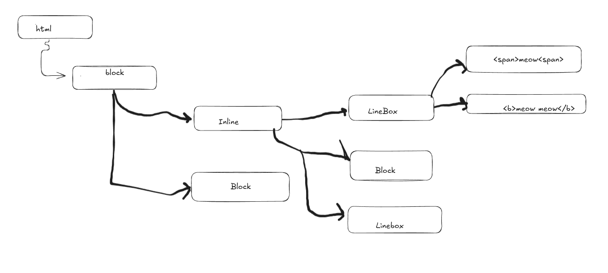

Making this its own notes page since wow, I have been writing a lot of notes 

https://www.w3.org/TR/CSS22/visuren.html

"Certain values of the 'display' property cause an element of the source document to generate a principal box that contains descendant boxes and generated content and is also the box involved in any positioning scheme. Some elements may generate additional boxes in addition to the principal box: 'list-item' elements. These additional boxes are placed with respect to the principal box."

https://www.w3.org/TR/CSS22/visuren.html#display-prop -> will these be our classes?? 

"Boxes in the normal flow belong to a formatting context, which in CSS 2.2 may be table, block or inline. In future levels of CSS, other types of formatting context will be introduced. Block-level boxes participate in a block formatting context. Inline-level boxes participate in an inline formatting context. Table formatting contexts are described in the chapter on tables."

Mayhaps we implement normal flow then??? 

I have been thinking about the original document tree too much: our box layout doesn't have to conform to that. It is separate to the DOM??? Is it? I suppose???!??!?!?! 

It is, the DOM we created was the nodes with Element and Text classes. What we are creating now is different. 

What is the DOM anyway? https://dom.spec.whatwg.org/

Let's take a look at the LadyBird browser mayhaps, or maybe chromium. Git cloning just because I want to look at the source code for inspiration/understanding. 

Looking at the source code for the Ladybird browser, I am reminded that building a fully-fledged web browser is actually an insane task so I am just going to take things back a step. I laid out an approach that is janky but will work. Hell, my current approach technically works. What I need to do is just decide on what subset I want to support, then focus on that. 

A day later let's try again:

* Start with the Document layout, it creates a blocklayout.
* Block layout will iterate through its children. Consecutive non-block children will end up in the same inline layout object, else child will be a new block element
* Inline Layout will handle one or more inline layout children. It will dfs iterate through them to lay them out in a 'lines' array
* If an inline element has a blocklayout element as a child, log a warning, flush current iline elements and make the blocklayout a child on a single line 

Its a bit weird I know but I think it will work for our porpoises. There is a chance I have to get rid of my inheritance pattern :(
At the very least I can get rid of certain methods that were only there to facilitate inline layouts (like the getXContinue, which will no longer be necessary).
So for the time being let's get rid of the methods I won't think I will need and change the constructor so it isn't super specific.

Thought: since we want all nodes to have a valid previous component, I am going to create a 'linebox' class to hold the lines for an inline element. This way, any block element of an inline element will still have a correct previous value. 

Linebox will use a stack to keep track of things like background colors, borders etc. 