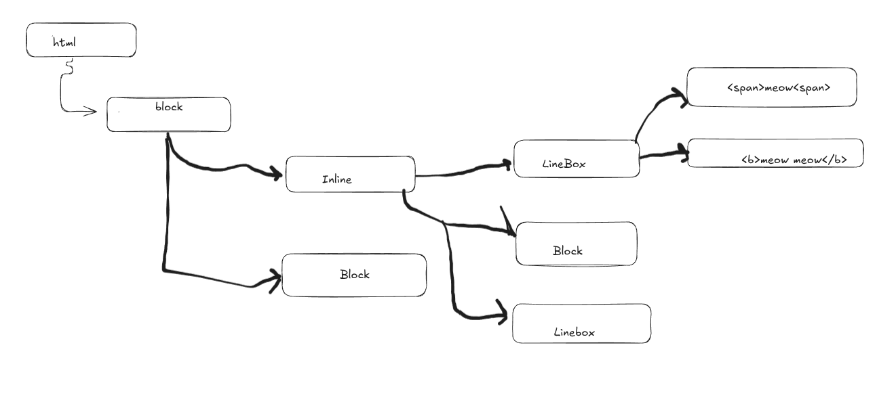

# Visual Formatting Model

## Box Generation

1. Generated Boxes act as containing blocks for descendant boxes (for now there is no desire to handle other types of positioning).
2. "Block-level elements are those elements of the source document that are formatted visually as blocks (e.g., paragraphs)"
3. Thus block level elements are a separate thing to block level boxes (boxes aren't a part of the source document, that is what we generate).
4. "Block-level boxes are boxes that participate in a block formatting context. Each block-level element generates a principal block-level box that contains descendant boxes and generated content and is also the box involved in any positioning scheme"
5. So we start with Principal block level boxes, that is our 'anchor' for how we display other things
6. "Except for table boxes, which are described in a later chapter, and replaced elements, a block-level box is also a block container box. A block container box either contains only block-level boxes or establishes an inline formatting context and thus contains only inline-level boxes."
7. Block container box means either all block level children or all inline children. Table boxes will be their own weird thing. 
8. "A block container box either contains only block-level boxes or establishes an inline formatting context and thus contains only inline-level boxes. Not all block container boxes are block-level boxes: non-replaced inline blocks and non-replaced table cells are block containers but not block-level boxes. Block-level boxes that are also block containers are called block boxes."
9. So, Block Level relates to the formatting context. If we see 'Block-Level' box it means we know we are in a block formatting contex ie: how do we format our children
10. But a block Container box deals with what our children are, not necessarily how we lay them out (I think).
11. "if a block container box (such as that generated for the DIV above) has a block-level box inside it (such as the P above), then we force it to have only block-level boxes inside it."
12. I think this may mean we need a depth first building algorithm. 
13. "When an inline box contains an in-flow block-level box, the inline box (and its inline ancestors within the same line box) are broken around the block-level box (and any block-level siblings that are consecutive or separated only by collapsible whitespace and/or out-of-flow elements), splitting the inline box into two boxes (even if either side is empty), one on each side of the block-level box(es). The line boxes before the break and after the break are enclosed in anonymous block boxes, and the block-level box becomes a sibling of those anonymous boxes. When such an inline box is affected by relative positioning, any resulting translation also affects the block-level box contained in the inline box." 
14. "The properties of anonymous boxes are inherited from the enclosing non-anonymous box (e.g., in the example just below the subsection heading "Anonymous block boxes", the one for DIV). Non-inherited properties have their initial value. For example, the font of the anonymous box is inherited from the DIV, but the margins will be 0."
15. "Inline-level elements are those elements of the source document that do not form new blocks of content; the content is distributed in lines (e.g., emphasized pieces of text within a paragraph, inline images, etc.). The following values of the 'display' property make an element inline-level: 'inline', 'inline-table', and 'inline-block'. Inline-level elements generate inline-level boxes, which are boxes that participate in an inline formatting context."
16. "Inline-level elements generate inline-level boxes, which are boxes that participate in an inline formatting context." 
17. So if we see an inline-level element, it must generate an inline-level box.
18. "An inline box is one that is both inline-level and whose contents participate in its containing inline formatting context."
19. "A non-replaced element with a 'display' value of 'inline' generates an inline box. Inline-level boxes that are not inline boxes (such as replaced inline-level elements, inline-block elements, and inline-table elements) are called atomic inline-level boxes because they participate in their inline formatting context as a single opaque box."
20. So an inline-level box is one with a display property 'inline','inline-table' or 'inline-block'. BUT only a non-replaced element with display 'inline' creates an inline blox (its inline level and contents are inline-formatting context). In the other cases we have atomic inline-level boxes.
21. "Any text that is directly contained inside a block container element (not inside an inline element) must be treated as an anonymous inline element." ... "The latter are called anonymous inline boxes, because they do not have an associated inline-level element."
22. Anon inline boxes are inline boxes that do not have an associated inline-level element (from the source document).
23. There are 3 positioning schemes in CSS2.1 and we care about Normal flow for now. It has block formatting, inline formatting and relative positioning.
24. "Boxes in the normal flow belong to a formatting context, which may be block or inline, but not both simultaneously. Block-level boxes participate in a block formatting context. Inline-level boxes participate in an inline formatting context."
25. "block containers (such as inline-blocks, table-cells, and table-captions) that are not block boxes, and block boxes with 'overflow' other than 'visible' (except when that value has been propagated to the viewport) establish new block formatting contexts for their contents."
26. For us does that just mean block containers that are not block boxes?
27. "In an inline formatting context, boxes are laid out horizontally, one after the other, beginning at the top of a containing block. Horizontal margins, borders, and padding are respected between these boxes. The boxes may be aligned vertically in different ways: their bottoms or tops may be aligned, or the baselines of text within them may be aligned. The rectangular area that contains the boxes that form a line is called a line box."
28. "A line box is always tall enough for all of the boxes it contains. However, it may be taller than the tallest box it contains (if, for example, boxes are aligned so that baselines line up). When the height of a box B is less than the height of the line box containing it, the vertical alignment of B within the line box is determined by the 'vertical-align' property. When several inline-level boxes cannot fit horizontally within a single line box, they are distributed among two or more vertically-stacked line boxes. Thus, a paragraph is a vertical stack of line boxes. Line boxes are stacked with no vertical separation (except as specified elsewhere) and they never overlap."
29. "When an inline box exceeds the width of a line box, it is split into several boxes and these boxes are distributed across several line boxes"
30. "Line boxes are created as needed to hold inline-level content within an inline formatting context."

Looking at WeasyPrint, it seems like it does a 2 pass algorithm. It first creates boxes directly based on HTML elements, display fields and such (see Document.py 'root_box = build_formatting_structure(...)'). Only later does it then add in the LineBoxes (see create_anonymous_boxes call in build_formatting_structure function).

And my suspicions are confirmed: first lineBoxes are created with the assumption that everything can fit inside of one line, with splitting handled later!!! Yay!

## Cases to cater for 
1. Text inside div 
2. Inline inside block 
3. Inline inside of inline
4. Block inside of inline
5. Inline block inside of block
6. Inline block inside of inline 
7. 

## Algorithm 

At least a 2 pass algorithm it seems.  


# Old content below, ignore.

Making this its own notes page since wow, I have been writing a lot of notes 

https://www.w3.org/TR/CSS22/visuren.html

"Certain values of the 'display' property cause an element of the source document to generate a principal box that contains descendant boxes and generated content and is also the box involved in any positioning scheme. Some elements may generate additional boxes in addition to the principal box: 'list-item' elements. These additional boxes are placed with respect to the principal box."

https://www.w3.org/TR/CSS22/visuren.html#display-prop -> will these be our classes?? 

"Boxes in the normal flow belong to a formatting context, which in CSS 2.2 may be table, block or inline. In future levels of CSS, other types of formatting context will be introduced. Block-level boxes participate in a block formatting context. Inline-level boxes participate in an inline formatting context. Table formatting contexts are described in the chapter on tables."

Mayhaps we implement normal flow then??? 

I have been thinking about the original document tree too much: our box layout doesn't have to conform to that. It is separate to the DOM??? Is it? I suppose???!??!?!?! 

It is, the DOM we created was the nodes with Element and Text classes. What we are creating now is different. 

What is the DOM anyway? https://dom.spec.whatwg.org/

Let's take a look at the LadyBird browser mayhaps, or maybe chromium. Git cloning just because I want to look at the source code for inspiration/understanding. 

Looking at the source code for the Ladybird browser, I am reminded that building a fully-fledged web browser is actually an insane task so I am just going to take things back a step. I laid out an approach that is janky but will work. Hell, my current approach technically works. What I need to do is just decide on what subset I want to support, then focus on that. 


A day later let's try again:

* Start with the Document layout, it creates a blocklayout.
* Block layout will iterate through its children. Consecutive non-block children will end up in the same inline layout object, else child will be a new block element
* Inline Layout will handle one or more inline layout children. It will dfs iterate through them to lay them out in a 'lines' array
* If an inline element has a blocklayout element as a child, log a warning, flush current iline elements and make the blocklayout a child on a single line 

Its a bit weird I know but I think it will work for our porpoises. There is a chance I have to get rid of my inheritance pattern :(
At the very least I can get rid of certain methods that were only there to facilitate inline layouts (like the getXContinue, which will no longer be necessary).
So for the time being let's get rid of the methods I won't think I will need and change the constructor so it isn't super specific.

Thought: since we want all nodes to have a valid previous component, I am going to create a 'linebox' class to hold the lines for an inline element. This way, any block element of an inline element will still have a correct previous value. 



Linebox will use a stack to keep track of things like background colors, borders etc. 

I am confusing myself a lot because of how borders look on spans :/ 

I think I have a border algorithm: 
* anytime you finish a line, you prepend your border commands to the lines array
* this way, the parent will keep track of whether to show a border on left/right and childrens borders will also still show in correct order (they will be drawn after parent's border)
* could also do background colors like this I suppose. Yeah, this is exactly how we will do things. 

Finalizing an algorithm is hard since as soon as you start going through the given algorithm you discover you need to tweak it. 

Another change I am making is to make the paint() call recursive for nodes. That way you don't need another function (like the book's ```paint_tree```) to do the recursion for you (ie we abstract this away). 

python3 -m unittest tests.test_Layout